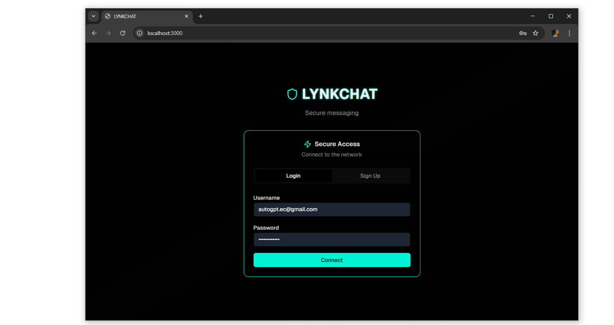
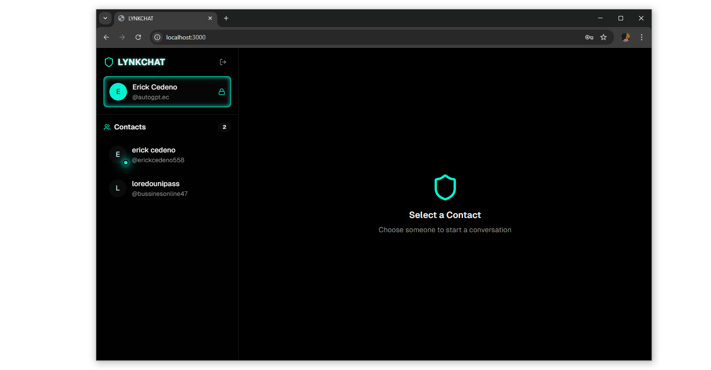
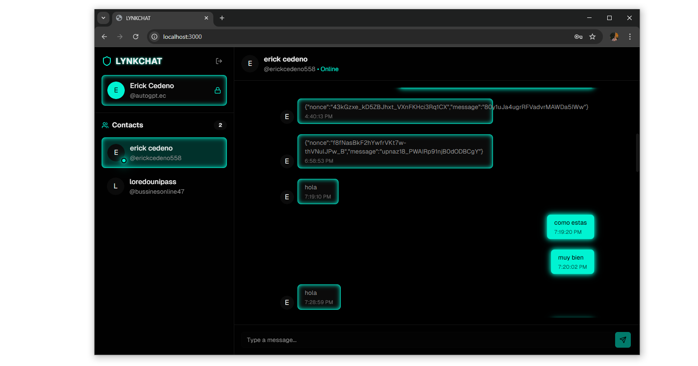

# LYNKCHAT

LYNKCHAT is a real-time chat application built with the MERN stack (MongoDB, Express, React, Node.js) and Socket.io. It provides a platform for users to communicate with each other instantly.

## Technologies

Below are the main technologies used in this project.


- **Javascript**
[](https://developer.mozilla.org/en-US/docs/Web/JavaScript)

- **Typescript**
[](https://www.typescriptlang.org/)

- **Next.js**
  [](https://nextjs.org/)

- **Node.js**
  [](https://nodejs.org/)

- **Express.js**
  [](https://expressjs.com/)

- **JSON Web Tokens (JWT)**
  [](https://jwt.io/)

- **Tailwind CSS**
  [](https://tailwindcss.com/)

- **MongoDB**
  [](https://www.mongodb.com/)

- **Socket.IO**
  [](https://socket.io/)

---

## Features

*   User authentication (signup and login)
*   Real-time messaging with Socket.io
*   Online user status
*   Message read status
*   Typing indicators
*   Secure password hashing
*   JWT-based authentication
*   Mongoose for MongoDB object modeling

## Technologies Used

### Backend

*   **Node.js:** JavaScript runtime environment
*   **Express:** Web framework for Node.js
*   **MongoDB:** NoSQL database
*   **Mongoose:** Object Data Modeling (ODM) library for MongoDB
*   **Socket.io:** Library for real-time, bidirectional and event-based communication
*   **JSON Web Token (JWT):** For secure user authentication
*   **bcryptjs:** For password hashing
*   **cookie-parser:** For parsing cookies

## Backend Installation

To get the backend server running locally, follow these steps:

1.  **Clone the repository:**

    ```bash
    git clone https://github.com/Erick-MC-Cedeno/LYNKCHAT.git
    cd LYNKCHAT/backend
    ```

2.  **Install dependencies:**

    This project uses `pnpm` as the package manager. You can install it with `npm install -g pnpm`.

    ```bash
    pnpm install
    ```

    Alternatively, you can use `npm`:

    ```bash
    npm install
    ```

3.  **Set up environment variables:**

    Create a `.env` file in the `backend` directory and add the following variables:

    ```
    PORT=5000
    MONGO_DB_URI=<YOUR_MONGODB_CONNECTION_STRING>
    JWT_SECRET=<YOUR_JWT_SECRET>
    ```

    *   `PORT`: The port on which the server will run.
    *   `MONGO_DB_URI`: Your MongoDB connection string.
    *   `JWT_SECRET`: A secret key for signing JWTs.

4.  **Run the server:**

    ```bash
    nodemon server.js
    ```

    The server will start on the port specified in your `.env` file (e.g., `http://localhost:5000`).

## API Endpoints

All endpoints are prefixed with `/api`.

### Auth

*   **`POST /auth/signup`**
    *   Registers a new user.
    *   **Request Body:** `fullName`, `username`, `password`, `gender`, `image` (optional).
    *   **Response:** `201 Created` with user object.

*   **`POST /auth/login`**
    *   Logs in a user.
    *   **Request Body:** `username`, `password`.
    *   **Response:** `200 OK` with user object.

*   **`POST /auth/logout`**
    *   Logs out a user.
    *   **Response:** `200 OK`.

### Users

*   **`GET /user`**
    *   Gets all users for the sidebar, excluding the logged-in user.
  *   **Response:** `200 OK` with an array of user objects.

### Messages

*   **`GET /messages/:id`**
    *   Gets the messages for a specific chat.
    *   `:id` is the ID of the other user in the conversation.
    *   **Response:** `200 OK` with an array of message objects.

*   **`POST /messages/send/:id`**
    *   Sends a message to a specific user.
    *   `:id` is the ID of the recipient.
    *   **Request Body:** `message` (string).
    *   **Response:** `201 Created` with the new message object.

## Screenshots

Here are some screenshots of the application UI. Click to view full size.

- Chat list / conversation

- Login screen

 

- Registration screen


- Chat list / conversation




  